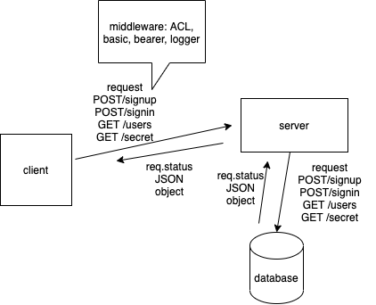

# LAB 8

## Project: AUTH API

### Author: Sara Strasner, pair programmed with Tina Myers

### Links and Resources

- [Latest PR](https://github.com/sarastrasner/auth-api/pull/6)
- [ci/cd](https://github.com/sarastrasner/auth-api/actions)
- [front-end application](https://sarastrasner-auth-api.herokuapp.com/) 

### Setup

#### `.env` requirements (where applicable)

- MONGODB_URI=mongodb://localhost:27017/api
- PORT=3000
- SECRET=BANANAS

#### How to initialize/run your application (where applicable)

- e.g. `npm start`

#### Tests

- The tests all run via jest in the terminal.
- All tests are passing.

#### WRRC & UML 

